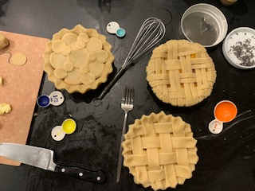
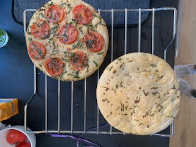
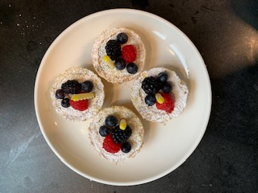

### Hello, folks! 👋
###   
 Audio learning in flight!! 

My name is Joanne de Leon - although most call me Jo or Jojo. I'm a recent graduate of Flatiron School's Data Science program. Currently on the hunt for a job, I've been keeping my brain engaged learning new skills and honing the old.      
     
  
📫 How to reach me: trudell1977@gmail.com    
You can find me on [ LinkedIn](https://www.linkedin.com/)
&nbsp;     

🔭 I’m currently working on AWS Cloud Practitioner Certification    
🌱 I’m currently learning Tableau   

💬 Ask me about ... my love of cooking and baking! 👩‍🍳  
    
     
     

Pronouns: she/her ♀️       
⚡ Fun fact: ... You can find me riding around Chicago on my bike taking photos on most weekends 🚴‍♀️   
### ❄️ Brrrr, Lake Michigan    
 
### 🪴 Garfield Conservatory

